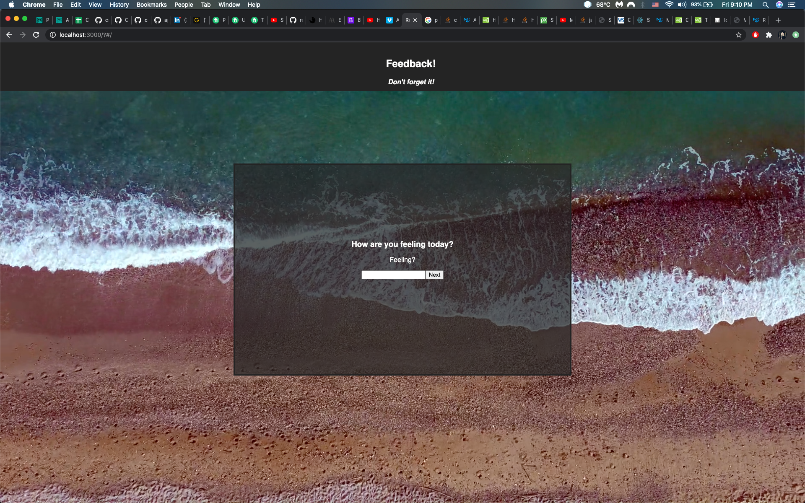
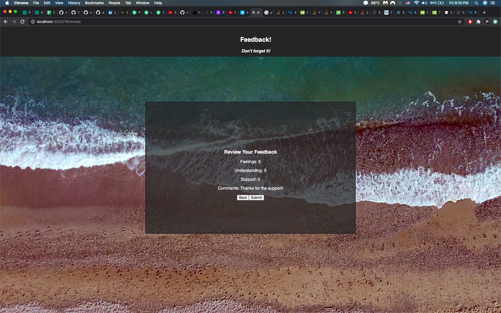
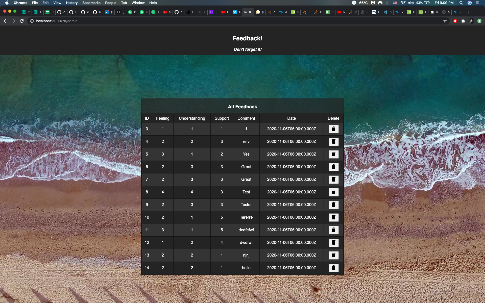

# WEEKEND FEEDBACK-LOOP

## Description

Time : 10 hours

This is a project is a feedback form. You will be asked a series of questions to be ranked from 1 to 5, and then submit them.
admins and review a full list of all the feedbacks at '/admin'

## Screen Shot

## Installation

1. Create a database named `prime_feedback`,
2. The queries in the `database.sql` file are set up to create all the necessary tables and populate the needed data to allow the application to run correctly. The project is built on [Postgres](https://www.postgresql.org/download/), so you will need to make sure to have that installed. We recommend using Postico to run those queries as that was used to create the queries,
3. Open up your editor of choice and run an `npm install || npm i`
4. Run `npm run server` and `npm run client` in your terminal to get the project up and running

## Usage

How does someone use this application? Tell a user story here.

1. Fill out each form as they come up
2. Submit the form
3. Monitor all querys at '/admin'

## Built With

1. Axios
2. React
3. Redux
4. PostgreSQL
5. Node
6. Express

## License

[MIT](https://choosealicense.com/licenses/mit/)

_Note, include this only if you have a license file. GitHub will generate one for you if you want!_

## Acknowledgement

Thanks to [Prime Digital Academy](www.primeacademy.io) who equipped and helped me to make this application a reality. (Thank your people)

## Support

If you have suggestions or issues, please email me at [csim6890@gmail.com](www.google.com)
